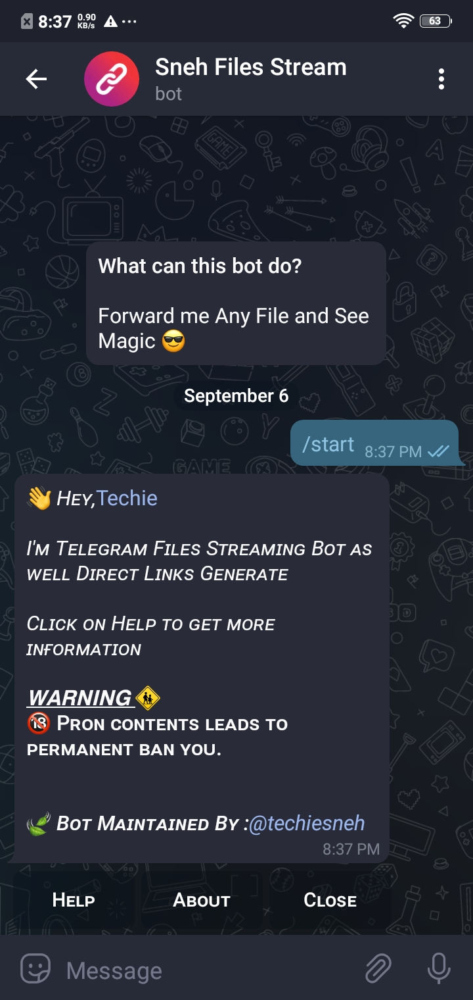
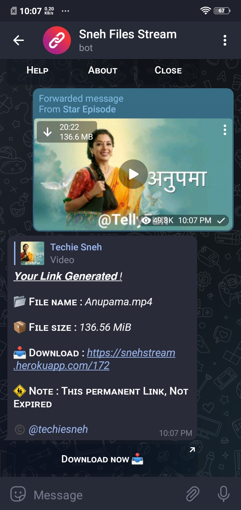

<p align="center">
    <a href="https://github.com/techiesneh/SnehStreamBot">
        
    </a>
    <h1 align="center">SnehFilesStream Bot</h1>
</p>

  <p align="center">
    A Telegram bot to stream all media and documents files to web link .
    <br />
   </strong></a>
    <br />
    <a href="https://github.com/techiesneh/SnehFilesStream/issues">Report a Bug</a>
    |
    <a href="https://github.com/techiesneh/SnehFilesStream/issues">Request Feature</a>
  </p>
</p>

<br>

#### 🔐 Use Bot :  
<a href="https://telegram.me/SnehFileStreamBot"></a>

<hr>


## 🍁 About This Bot :
<hr>

• All Media Supported.<br>
• Permanent Links it Never Expired.<br>
• Banned if you Send any Porn Contents. <br><br>

## 👑 How to Use :
<hr>

• Share any Files Here. <br>
• Now See the Magic. <br>
• You Got a Permanent Links. <br>
• Then Share with your friends and family. <br>
• You can also Stream Any Files of Telegram Without Downloading it .<br><br>


## ♢ How to make your own :

Either you could locally host or deploy on [Heroku](https://heroku.com)

<br>

#### ♢ Click on This Drop-down and get more details

<br>
<details>
  <summary><b>Deploy on Heroku :</b></summary>


1. Fork This Repo
2. Click on Deploy Easily

<h4> So Follow Above Steps 👆 and then also deply other wise not work</h4>

Press the below button to Fast deploy on Heroku

[](https://heroku.com/deploy)

then goto the <a href="#mandatory-vars">variables tab</a> for more info on setting up environmental variables. </details>


<details>
  <summary><b>Host it on VPS Locally :</b></summary>


```py
git clone https://github.com/techiesneh/SnehStreamBot
cd SnehStreamBot
virtualenv -p /usr/bin/python3 venv
. ./venv/bin/activate
pip install -r requirements.txt
python3 -m WebStreamer
```

and to stop the whole bot,
 do <kbd>CTRL</kbd>+<kbd>C</kbd>

Setting up things

If you're on Heroku, just add these in the Environmental Variables
or if you're Locally hosting, create a file named `.env` in the root directory and add all the variables there.
An example of `.env` file:

```py
API_ID=12345
API_HASH=esx576f8738x883f3sfzx83
BOT_TOKEN=55838383:yourtbottokenhere
BIN_CHANNEL=-100
PORT=8080
FQDN=your_server_ip
OWNER_ID=your_user_id
DATABASE_URL=mongodb_uri
```
  </details>

<details>
  <summary><b>Vars and Details :</b></summary>

`API_ID` : Goto [my.telegram.org](https://my.telegram.org) to obtain this.

`API_HASH` : Goto [my.telegram.org](https://my.telegram.org) to obtain this.

`BOT_TOKEN` : Get the bot token from [@BotFather](https://telegram.dog/BotFather)

`BIN_CHANNEL` : Create a new channel (private/public), add [@missrose_bot](https://telegram.dog/MissRose_bot) as admin to the channel and type /id. Now copy paste the ID into this field.

`OWNER_ID` : Your Telegram User ID

`DATABASE_URL` : MongoDB URI for saving User IDs when they first Start the Bot. We will use that for Broadcasting to them. I will try to add more features related with Database. If you need help to get the URI you can ask in [Me Telegram](https://t.me/techiesneh).

 Option Vars

`UPDATES_CHANNEL` : Put a Public Channel Username, so every user have to Join that channel to use the bot. Must add bot to channel as Admin to work properly.

`BANNED_CHANNELS` : Put IDs of Banned Channels where bot will not work. You can add multiple IDs & separate with <kbd>Space</kbd>.

`SLEEP_THRESHOLD` : Set a sleep threshold for flood wait exceptions happening globally in this telegram bot instance, below which any request that raises a flood wait will be automatically invoked again after sleeping for the required amount of time. Flood wait exceptions requiring higher waiting times will be raised. Defaults to 60 seconds.

`WORKERS` : Number of maximum concurrent workers for handling incoming updates. Defaults to `3`

`PORT` : The port that you want your webapp to be listened to. Defaults to `8080`

`WEB_SERVER_BIND_ADDRESS` : Your server bind adress. Defauls to `0.0.0.0`

`NO_PORT` : If you don't want your port to be displayed. You should point your `PORT` to `80` (http) or `443` (https) for the links to work. Ignore this if you're on Heroku.

`FQDN` :  A Fully Qualified Domain Name if present. Defaults to `WEB_SERVER_BIND_ADDRESS` </details>

<details>
  <summary><b>How to Use :</b></summary>

:warning: **Before using the  bot, don't forget to add the bot to the `BIN_CHANNEL` as an Admin**
 
`/start` : To check if the bot is alive or not.

To get an instant stream link, just forward any media to the bot and boom, its fast af.

### Channel Support
Bot also Supported with Channels. Just add bot Channel as Admin. If any new file comes in Channel it will edit it with **Get Download Link** Button. </details>


## 📷 Some Screenshots :
<hr>

<div>

<br>

<br>


</div> 


<br>

#### 🔐 Use Bot :  
<a href="https://telegram.me/SnehFileStreamBot"></a>

<hr>


### 😉 Thanks To :
<a href="https://github.com/techiesneh">Techie Sneh</a><br>


