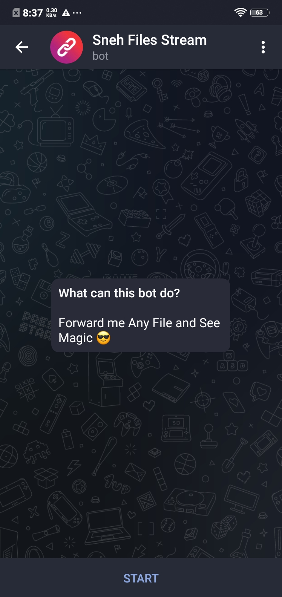
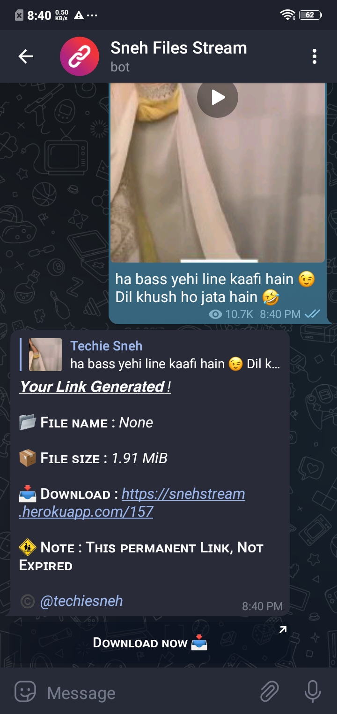
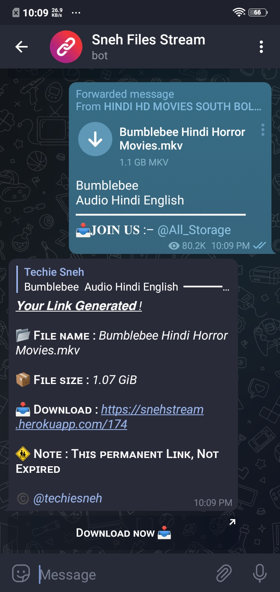

    
    <h1 align="center">SnehFilesStream Bot</h1>

  

    A Telegram bot to stream all media and documents files to web link .
     
   </strong></a>
     
    <a href="https://github.com/techiesneh/SnehFilesStream/issues">Report a Bug</a>
    |
    <a href="https://github.com/techiesneh/SnehFilesStream/issues">Request Feature</a>
  

 

#### 🔐 Use Bot :  

## 🍁 About This Bot :

• All Media Supported. 
• Permanent Links it Never Expired. 
• Banned if you Send any Porn Contents.   

## 👑 How to Use :

• Share any Files Here.  
• Now See the Magic.  
• You Got a Permanent Links.  
• Then Share with your friends and family.  
• You can also Stream Any Files of Telegram Without Downloading it .  

## 📷 Some Screenshots :

 

 

 

#### 🔐 Use Bot :  

### 😉 Thanks To :
<a href="https://github.com/techiesneh">Techie Sneh</a> 

